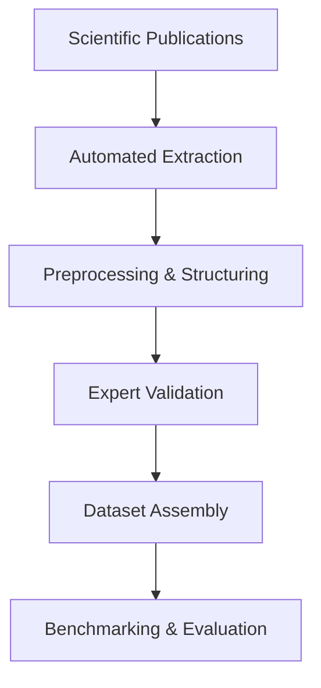

# Methodological Approach

---

## Overview

This section outlines the methodological framework of the **ChemEx** project, which forms the foundation for creating high-quality, multimodal chemical datasets.  
It presents the core pipeline stages — from extraction to benchmarking — and highlights the guiding principles behind the design of the data processing workflows.

---

## General Pipeline

<small>Core data processing pipeline used in ChemEx</small>

---

## Methodological Principles

!!! info "Core Design Principles"
    - **Domain coverage**: datasets span multiple chemical areas (e.g., nanomaterials, ionic liquids, small molecules)
    - **Multimodal input**: structured extraction from text, tables, and figures
    - **Hybrid automation**: combination of LLM-based extraction with expert review
    - **Reproducibility**: public schemas, transparent metadata, and documentation
    - **Rigorous validation**: use of standardized benchmarks to assess model performance

---

## Methodological Components

### 1. Data Extraction

Information is automatically extracted from PDFs of scientific papers using a combination of:

- **Large Language Models (LLMs)** for text interpretation and extraction
- **OCR and structure recognition tools** such as MolScribe and DECIMER for parsing chemical structures and figures
- **Domain-specific NLP models** like ChemBERTa for named entity recognition and relation extraction

[Learn more about data extraction](data_extraction.md)

---

### 2. Data Validation

To ensure data accuracy, extracted outputs are systematically reviewed by domain experts. This includes:

- Manual cross-checking and correction of extracted data  
- Consistency validation against chemical knowledge and known properties  
- Error analysis of model-generated outputs (e.g., hallucinations or misparsed values)

[Learn more about data validation](data_validation.md)

---

### 3. Benchmarking and Evaluation

Performance of automated methods is assessed via structured benchmarks using manually curated datasets. Evaluation includes:

- Standard metrics (e.g., precision, recall, F1 score, exact match)  
- Visualization tools (e.g., radar charts, confusion matrices) for intuitive comparison  
- Detailed error breakdown to guide future model improvements

[Learn more about benchmarking](benchmarking.md)

---

## Relationship to Datasets

!!! tip "Applying the Pipeline to ChemX Datasets"
    - All datasets are processed through the unified ChemEx pipeline  
    - Method parameters are tuned to the specifics of each dataset (e.g., image-heavy nanomaterials vs. text-based small molecules)  
    - Validation and benchmarking outcomes are documented and released with the datasets

📁 Explore the [Datasets Description](../overview/datasets_description.md) section to see how methodology shapes each dataset.

---

## Conclusion

The ChemEx methodology provides a robust and scalable framework for producing high-quality chemical datasets.  
It bridges cutting-edge AI tools with expert human oversight, enabling reliable information extraction across the complex landscape of chemical literature.
